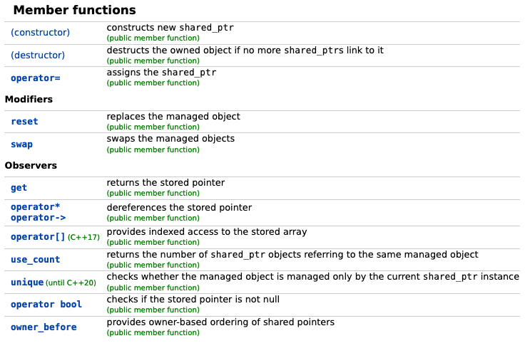
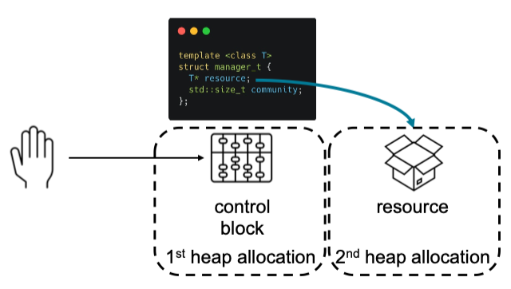

# **Resource Management**

<!-- _paginate: skip  -->
<!-- _class: titlecover -->
<!-- _footer: "" -->

### About RAII, ownership, pointers and guidelines
Alberto Invernizzi, CSCS (alberto.invernizzi@cscs.ch)

---
<style scoped>
    section {
        display: flex;
        align-items: center;
    }
</style>


<span>
C++ is an object-oriented programming language that among its main selling points has

- 🏎️ Performances
- 🎛️ Letting the user have full control over resources

**Performance** and **full-control** are somehow faces of the same coin: full control allows to do very clever and smart things to get best performances.
</span>

---
<!-- _class: lead -->

*"... and with great power comes great responsibility."*


---
# Resource Management

+ Memory
+ File
+ Socket
+ Mutex
+ MPI Communicator
+ ...

Full control of a resource means managing it correctly by
+ 🤝 initializing/acquiring it
+ 👮‍♂️ keeping it alive till needed
+ 👋 release it cleanly when not useful anymore.

---
# Why should we care?


Not managing correctly resources may end up in subtle bugs...

+ in the "best" case a memory leak
+ in (one of) the worst cases a race-condition 💥 (**=nightmare** 😱).

---


Managing the lifetime of a resource in an object-oriented context easily becomes difficult.

- objects are created,
- objects are manipulated
- objects are passed around to interact with other parts of the program
- ...

When the program complexity starts increasing, to ensure the correct management of these resources “manually” becomes unsustainable.

...and with concurrency it becomes even more difficult (**="impossible"** 🤯).

---
# <center>FULL CONTROL != DO IT MANUALLY</center>

Some languages address this using **garbage collectors**, but this comes at the expense of performances and control. So, it's not a solution for C++...

 but having full control does not imply having to do it manually.

The language, through the compiler, is at our disposal. We can and should leverage it at our service.

Here we are going to see what tools the language offers us and which we can and should rely on to keep things under control and writing

<div align=center>

**READABLE**, **CORRECT** and **EFFICIENT** code.

<div>

---
# RAII

**RAII**, which stands for *Resource Allocation Is Initialization*, is a programming technique that binds resource acquisition to **object lifetime**.

If an object follows RAII, it ensures that:
+ the resource is acquired/allocated/initialized when the object is initialised
+ it will be available for the lifetime of the object
+ and when the object is destroyed (it goes out of scope) the binded resource will be released too.

---
# Ownership

A fundamental concept that goes along with RAII is the one of **OWNERSHIP**.

With RAII an object starts representing the ownership of the resource, so it has the responsibility of the correct management.

Developer does not have anymore the direct responsibility of the resource, but it does not mean they don’t have anymore control over it.

We delegated the hard-work of managing correctly the resource to the object and we can now reason about its ownership.

It’s a higher level of control, we don’t care anymore about what happens when the resource has to be created/released, we just have to think where and how long we need the resource and manipulate the object accordingly.

---
<!-- _class: lead -->


## Use-case with pointers
## (Resource = Memory)

---
# Raw Pointers

Every C and C++ developer had to overcome the obstacle of pointers...

<div class="twocolumns">

<div>

```cpp
// STACK
int value = 26;
int *pointer_on_stack = &value;

// HEAP
int* pointer = new int(26);
int* pointer_array = new int[13];
```

</div>
</div>

But are they the right tool for managing resources (i.e. memory in this case)?

<div class="twocolumns">
<div>

```cpp
// TODO example where I need a buffer (being it a variable or an array),
// I do some calculation that might return at some point (e.g. in a for-loop)
// and it might skip the delete at the end of the function

void cumulative(int n, int* vec) {
    int* buffer = new int[13];

    for (int i = 0; i < 13; ++i) {
        int val = vec[i];
        if (val == 0)
            return;
    }

    delete[] buffer;
}
```

</div>
</div>

---
# Problem: who is responsible?

Even without looking at the documentation, it seems clear that this function "allocates" and a reasonable expectation is that on exit `T` should point to the just allocated resource.

```cpp
gsl_multifit_fsolver * gsl_multifit_fsolver_alloc (const gsl_multifit_fsolver_type * T, size_t n, size_t p);
```

+ is it up to me to deallocate it?
+ or is there any global manager in the library that on finalization will clear all requested resources?

```cpp
// TODO find a more clear TrivialPtr
```

---
# Problem: how should it be released?

How was it allocated?

+ new -> delete
+ new[] -> delete[]
+ malloc -> free

```cpp
int allocate(int* vec) {

}
```

---
# Problem: burden of the management

+ Remember to do it
+ Do it in the correct order (e.g. dependencies between resources)

```cpp
int* ptr = new int[26];
int
```

---
# Problem: have you considered all execution paths?

If a function has multiple return statements, you may have to care about it multiple times...

<div class="twocolumns">

```cpp
bool foo(int a, int b) {
    int buffer = new int[10];

    // ... (using buffer)

    if (a == 0) {
        return false;
    }

    // ... (using buffer)

    delete[] buffer;
    return true;
}
```

</div>

---
# Problem: ... even exceptions?

In case of an exception not managed, it becomes impossible to manage correctly the release...

<div class="twocolumns">

```cpp
float foo(int a, int b) {
    int buffer = new int[10];

    // ... (using buffer)

    // possibly throwing operation...
    float result = a / b;

    // if previous instruction throws...
    // ...nobody is going to release buffer
    delete[] buffer;
    return result;
}
```

</div>

---
<!-- _class: lead -->

# <!-- fit  --> Raw pointers do not follow RAII and do not express ownership.

---
<!-- _class: lead -->


<div style="width: 50%; position: absolute; right: 0; margin: 3%">

## <span style="color: white">What if we could have an object that allows us to avoid these problems by implementing RAII and expressing ownership?!</span>

</div>

---
# Object Lifetime - C'tor and D'tor

RAII binds a resource to object lifetime. Let's see what are the main handles we have on object lifetime.

<div class="twocolumns">

```c++
{
    TrivialPtr a;       // c'tor is called

    // ...
}                       // d'tor is called
```

</div>

The language gives us the handle to the moment when an object starts is lifetime through its **constructor**!

And what happen when it goes out of scope? It gets destroyed...and the language gives us the chance to customize what happens at destruction time through its **destructor**!

</div>
</div>

---
# Object Lifetime

<div class="twocolumns">
<div>

```c++
struct TrivialPtr {
    TrivialPtr() = default;            // default c'tor

    TrivialPtr(int* ptr) {             // custom c'tor
        ptr_ = ptr;
    }

    ~TrivialPtr() {                    // d'tor
        if (ptr_)
            delete ptr_;
    }
private:
    int* ptr_ = nullptr;
};
```

</div>
<div>

+ **C’tors** what to do when an object is created
  + (default) no resource managed by the obejct
  + (custom)  bind a resource to the object
+ **D’tor** what to do when an object is destroyed
  + if object is bound to a resource, release it

</div>
</div>

**The real magic 🪄 resides in the d'tor part**. It gets called as soon as an object lifetime ends:

+ it goes out of scope (e.g. block, expression, ...)
+ stack unwinding, i.e. when an exception is uncaught

We are binding a resource with an object on the *stack*, so we are transitively giving properties of an object on the stack to a resource!

---
# Object Lifetime in action: multipe return points

We don't have to care anymore about multiple execution paths! 🍾

<div class="twocolumns">

<div>

```cpp
void foo(int a, int b) {
    int* memory = new int[26];

    if (...) {
        // ...
        delete[] memory;
        return ;
    }

    delete[] memory;
}
```

</div>
<div>

```cpp
void foo(int a, int b) {
    TrivialPtr memory(new int(26));

    if (...) {
        // ...
        return ;
    }
}
```


</div>
</div>

---
# Object Lifetime in action: exceptions

We don't have to care anymore about exceptions too! 🍾

<div class="twocolumns">

<div>

```cpp
void foo(int a, int b) {
    int* memory = new int[26];

    if (...) {
        // ...
        delete[] memory;
        return ;
    }

    try {
        a / b;
    }
    catch (...) {
        delete[] memory;
    }

    // ...

    delete[] memory;
}
```

</div>
<div>

```cpp
void foo(int a, int b) {
    TrivialPtr memory(new int(26));    // call to c'tor

    if (...) {
        // ...
        return ;
    }

    a / b;

    // ... rest of code
}                                   // call to d'tor
```

</div>
</div>

In case the exception is thrown, rest of code won't be executed...but the stack unwinding ensures that all objects on the stack are destroyed, so the d'tor gets called and the resource is released cleanly! 😌

---
# Pimp up my class

We just started our journey in class customization, where we saw that we can

+ C'tor
+ D'tor

but even if programming gives power and freedom, it is wise to follow hints and guidelines...

---
# Rule of Three


If a class requires either a:
+ user-defined d'tor
`~TrivialPtr()`
+ user-defined copy c'tor
`TrivialPtr(const TrivialPtr&)`
+ user-defined copy assignment operator
`TrivialPtr& operator=(const TrivialPtr&)`

it almost certainly requires all three.

---
# User-defined vs implicitly-defined

**What if we don't define one of them?** We get an implicitly-defined one! (`= default`)

**What does it do?** Well, the language cannot know aforehead how the object should behave, so it does the most simple thing:

+ d'tor does nothing, i.e. empty body
+ copy-{c'tor, assigment}, copy by value all attributes

**What does it mean in our case?** `TrivialPtr` has a single attribute `ptr_`, which is a simple pointer, so it means copying the address into another object.

<center>

### 🤔 How bad can it go?! 🤔

🧙  RuleOfThree warned us *"...if you define one, you have to define all of them!"*.

</center>

---
# Object Lifetime - Copy C'tor & assignment operator

<div class="twocolumns">
<div>

```cpp
{
    TrivialPtr a(new int(26));      // c'tor
    {
        TrivialPtr b = a;           // copy-c'tor
    }                               // d'tor (b)
    TrivialPtr c;                   // default c'tor
    c = a;                          // copy-assignment
}                                   // d'tor (c and a)
```

</div>
<div>

https://godbolt.org/z/64bE4G3oW

</div>
</div>

+ `a` acquires the resource
+ in the inner block, `b` copies `a`'s resource address, because of the implicitly-defined *copy c'tor*
`a` and `b` now own "together" the same resource 💣
+ `b` goes out of scope so the resource gets released 👋
+ `c` will do the same that `b` did i.e. copy the address of `a`'s resource, because of the implicitly-defined *copy assignment operator*
+ ...but the resource has been already released! 💥

---
# What to do? Follow the *Rule Of Three*!

What *copy-{c'tor,assignment}* should do depends on how the object should behave on copy (*object semantic*).

- clone
should it allocate another identical and independent resource and copy its value?
- not-copyable
should it just not being copiable at all? (`= delete`)
- something else?
there might be other possible behaviors

Whatever you want it to do, you have to define it as the *Rule of Three* suggests. 🤓

---
# Object Lifetime

<div class="twocolumns">
<div>

Clone

```c++
struct TrivialPtr {
    // default c'tor
    TrivialPtr() = default;
    // custom c'tor
    TrivialPtr(int* ptr) : ptr_(ptr) {}
    // d'tor
    ~TrivialPtr() {
        if (ptr_)
            delete ptr_;
    }
    // copy c'tor
    TrivialPtr(const TrivialPtr& rhs) {
        ptr_ = new int(*rhs.ptr_);
    }
    // copy assignment operator (copy-and-swap idiom)
    TrivialPtr& operator=(const TrivialPtr& rhs) {
        TrivialPtr copy = rhs;
        std::swap(copy.ptr_, this->ptr_);
        return *this;
    }
private:
    int* ptr_ = nullptr;
};
```

https://godbolt.org/z/W5vffM7fM

</div>
<div>

Not-copyable

```c++
struct TrivialPtr {
    // default c'tor
    TrivialPtr() = default;
    // custom c'tor
    TrivialPtr(int* ptr) : ptr_(ptr) {}
    // d'tor
    ~TrivialPtr() {
        if (ptr_)
            delete ptr_;
    }
    // copy c'tor
    TrivialPtr(const TrivialPtr&) = delete;
    // copy assignment
    TrivialPtr& operator=(const TrivialPtr&) = delete;
private:
    int* ptr_ = nullptr;
};
```

https://godbolt.org/z/cPMvPd415

</div>
</div>

---
# First step towards a "smarter" than raw pointer

<div class="twocolumns">
<div>

```cpp
struct TrivialPtr {
    // default c'tor
    TrivialPtr() = default;
    // custom c'tor
    TrivialPtr(int* ptr) : ptr_(ptr) {}
    // d'tor
    ~TrivialPtr() {
        if (ptr_)
            delete ptr_;
    }
    // copy c'tor
    TrivialPtr(const TrivialPtr& rhs) = delete;
    // copy assignment operator
    TrivialPtr& operator=(const TrivialPtr& rhs) = delete;
private:
    int* ptr_ = nullptr;
};
```
</div>

<div>

+ **Who is responsible?** The object itself thanks to RAII
+ **How should it be released?** No worries, it is up to the object (it needs a specialization for `T[]`)
+ **Burden of the management?** Again, no worries...it is up to the object (and the language)
+ **All execution paths?** Yes! As soon as it goes out of scope, it will be released.
+ **...even in case of exceptions?** Yes, because stack unwinding makes the objects allocated on the stack to be destroyed, so their managed resource will be released cleanly.

</div>
</div>

**What do we have?** An object that represents ownership of a memory allocation and manages it. In this last implementation, it is not copyable, so the ownership of this resource is set in stone and cannot be moved or shared with any other object.

---
# Ownership

`TrivialPtr` is really a partial implementation of a "smarter" pointer, to the extent that it cannot be really defined a smart pointer (e.g. how do I access the memory in it?!) and it would need some extensions in order to make it useful.

But it already expresses the concept of **ownership**!

It is possible to differentiate mainly two types of ownership:
- **Unique (or exclusive) ownership**
when there is exactly one object instance managing a specific resource
- **Shared ownership**
when there are more objects managing the same resource.

<br/>

<center>

## What is the type of `TrivialPtr` ownership?

</center>

---
# STL Smart Pointers


STL provides a fully-featured solution for **smart pointers**:
+ `std::unique_ptr<T>` = unique ownership
+ `std::shared_ptr<T>` = shared ownership
+ `std::weak_ptr<T>` = shared ownership (specific use case)

Which are defined in the `<memory>` header.

---
# STL Smart Pointers API

<div class="twocolumns">
<div>

## `std::unique_ptr<T>`


</div>
<div>

## `std::shared_ptr<T>`



</div>
</div>

---
# `std::shared_ptr<T>`

<style scoped>
    img {
        display: flex;
        margin: 10px auto;
        width: 72%;
    }
</style>

<div class="twocolumns">

<div>


<cite>
1) Constructs a shared_ptr which shares ownership of the object managed by r. If r manages no object, *this manages no object either. [...]
</cite>

</div>
<div>

This is copyable, and the copyability for it has been implemented not to clone the resource but to "share" the resource, allowing to extend the ownership group.

As we trivially saw before, just copying the address was not enough for sharing correctly the same resource over two objects. The main problem was that once the address was copied, the two objects were not "linked" anyhow, so one didn't know if the other was still using the resource or not.

How can this information about usage be shared among multiple objects?
</div>
</div>

---
<style scoped>
    img {
        display: flex;
        margin: 0 auto;
        width: 55%;
    }
</style>

# `shared_ptr<T>`: the machinery

They are aka **reference counted smart pointers**, which exposes their internal mechanism.


In shared ownership, the management responsibility is shared among the group, and just the last object alive, is allowed to actually destroy the resource.

---
<style scoped>
    .image img {
        display: flex;
        margin: 0 auto;
        width: 60%;
    }
</style>

# `shared_ptr<T>`: the costs 1/2

<span>Heap allocations are not cheap 💰. Moreover having control block and resource allocated separately, might be expensive in case they end up far apart in memory.</span>

<div class="image">



</div>

<span style="display: inline-block; width:100%; text-align: center; color: red;">

Use `std::make_shared` which at least allocates both all at once, i.e. single allocation and close together.

</span>

---
<style scoped>
    .image img {
        display: flex;
        margin: 0 auto;
        width: 60%;
    }
</style>

# `shared_ptr<T>`: the costs 2/2

Each time we copy the `shared_ptr`, we are working on a shared control block. This access is thread safe, so it requires a synchronization, which is expensive 💰.

<div class="image">


</div>

<span style="display: inline-block; width:100%; text-align: center;">

*note: the control block is thread safe, not the resource usage!

</span>

---
<!-- _class: lead -->

# Raw vs Smart pointers

---
<!-- _class: lead -->

# ~~Raw vs Smart pointers~~
# Raw + Smart pointers

---
# Raw pointers are really useful!

Smart pointers are not a one solution fits all, raw pointers are still very useful!

The main point to keep in mind is about *ownership*:
+ Raw pointers (+ references) = non-owning
+ Smart pointers = owning

By using them correctly, you vehiculate a very important information via your API.

---
# CPP Core Guidelines

+ R.1: Manage resources automatically using resource handles and RAII
+ R.3: A raw pointer (a T*) is non-owning
+ R.4: A raw reference (a T&) is non-owning

+ R.10: Avoid malloc() and free()
+ R.11: Avoid calling new and delete explicitly

+ R.20: Use unique_ptr or shared_ptr to represent ownership
+ R.21: Prefer unique_ptr over shared_ptr unless you need to share ownership
+ R.22: Use make_shared() to make shared_ptrs
+ R.23: Use make_unique() to make unique_ptrs

+ R.30: Take smart pointers as parameters only to explicitly express lifetime semantics

(source: [https://isocpp.github.io/CppCoreGuidelines/CppCoreGuidelines#S-resource](https://isocpp.github.io/CppCoreGuidelines/CppCoreGuidelines#S-resource))

---
# Move semantic


TODO We are happy, we can manage resources and we have some guidelines. But as C++ programmers we are interested in performances, right? Let's think about an example with vector where we don't have move-semantic, and we perform a full copy.

Probably worth creating a dummy object that has an expensive clone (copy-ctor), like `std::vector`, that creates a deep-copy.

---
# Rule of Five


TODO

---
# Rule of Zero
TODO What do you see? a rabbit? a three? or a zero? There is one more additional rule.


---
# Initialization

TODO ?!