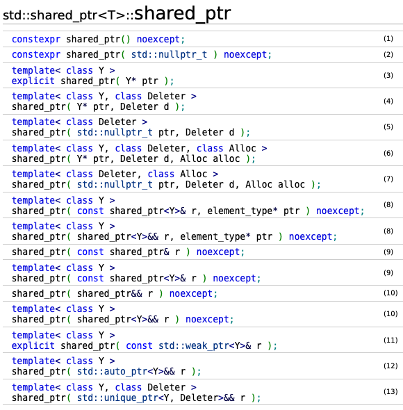
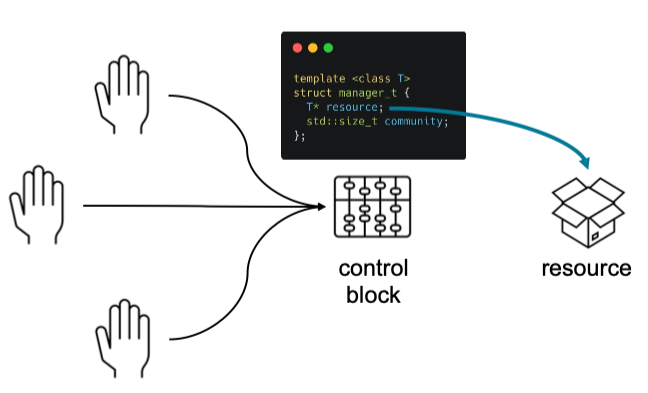
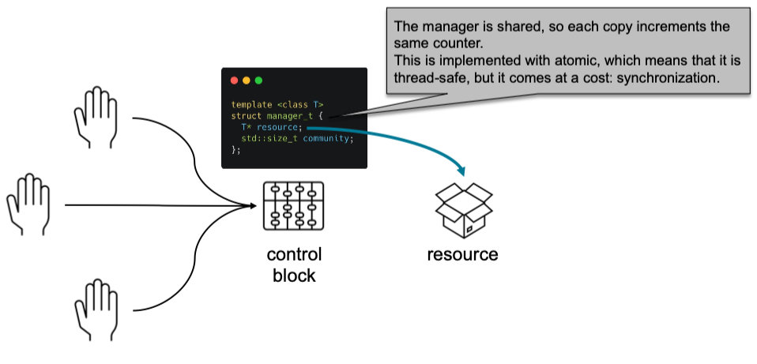
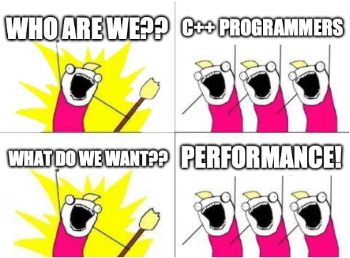
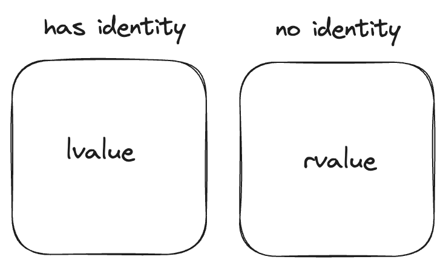
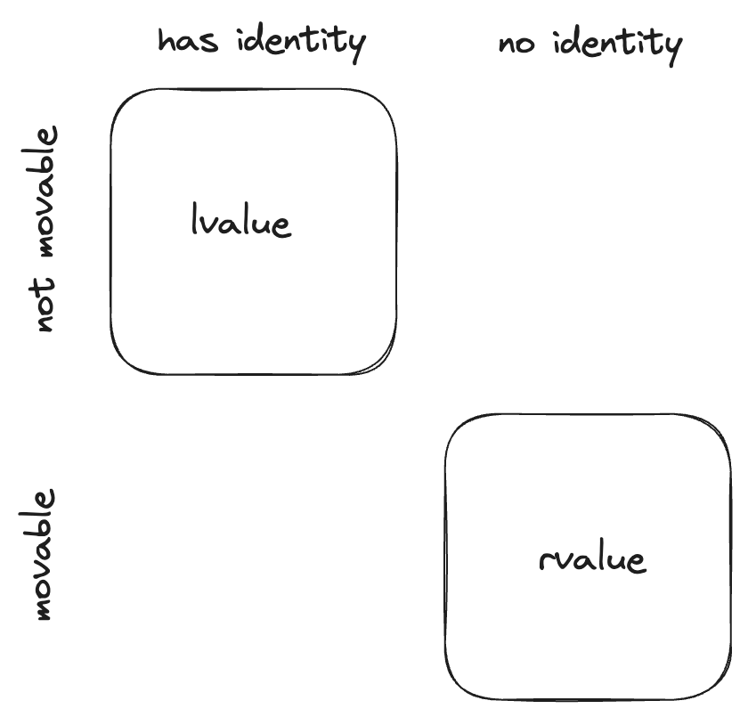
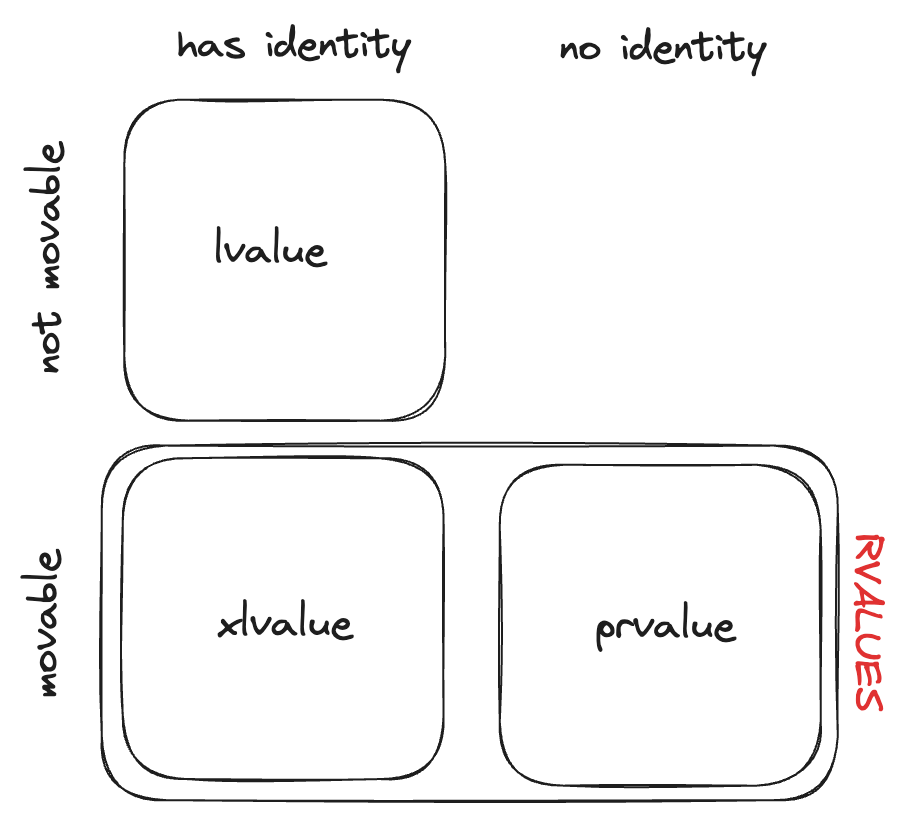
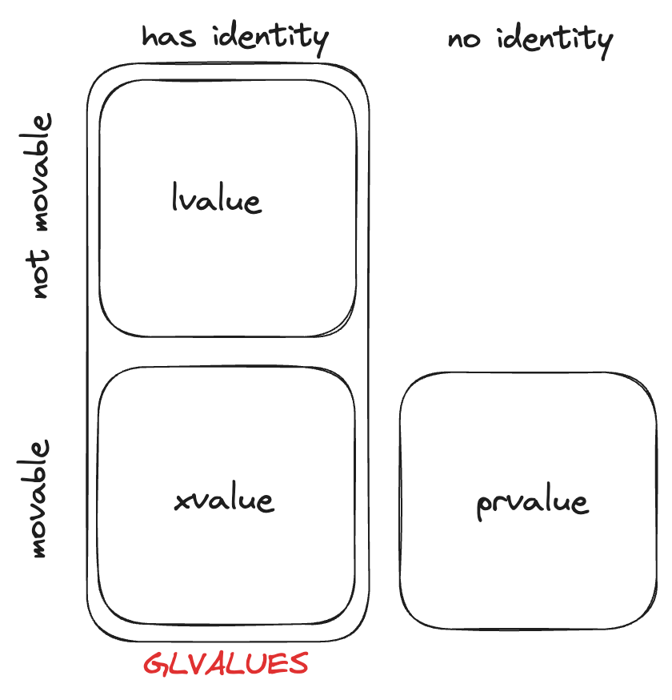

# **Resource Management**

<!-- _paginate: skip  -->
<!-- _class: titlecover -->
<!-- _footer: "" -->

### About RAII, ownership, pointers and guidelines
Alberto Invernizzi, CSCS (alberto.invernizzi@cscs.ch)

---
<style scoped>
    section {
        display: flex;
        align-items: center;
    }
</style>


<span>
C++ is an object-oriented programming language that among its main selling points has

- 🏎️ Performances
- 🎛️ Letting the user have full control over resources

**Performance** and **full-control** are somehow faces of the same coin: full control allows to do very clever and smart things to get best performances.
</span>

---
<!-- _class: lead -->

*"... and with great power comes great responsibility."*


---
# Example: Memory

Memory management is an important aspects for many application, be it for
+ for optimization reasons (e.g.reduce memory operations costs and overhead) or
+ memory limit constraints (e.g. embedded applications)

This is one of the reasons why C++ is used in many industries, from Game Development to HPC, where performance and control matters.

Indeed, C++ gives you all the knobs to manage the memory: when to allocate, when to deallocate, how much to allocate, ...

---
## It's not just about memory ... it's about RESOURCE!

+ Memory
+ File
+ Socket
+ Mutex
+ MPI Communicator
+ ...

Full control of a resource means managing it correctly by

+ 🤝 initializing/acquiring it
+ 👮‍♂️ keeping it alive till needed
+ 👋 release it cleanly when not useful anymore.

---
# Why should we care?


Not managing correctly resources may end up in subtle bugs...

+ in the "best" case a memory leak
+ in (one of) the worst cases a race-condition 💥 (**=nightmare** 😱).

---


Managing the lifetime of a resource in an object-oriented context easily becomes difficult.

- objects are created,
- objects are manipulated
- objects are passed around to interact with other parts of the program
- ...

When the program complexity starts increasing, to ensure the correct management of these resources “manually” becomes unsustainable.

...and with concurrency it becomes even more difficult (**="impossible"** 🤯).

---
# Full control does not imply hard to do!

Some languages address this using **garbage collectors**, but this comes at the expense of performances and control. So, it's not a solution for C++...

...but having full control does not imply having to do it manually.

The language, through the compiler, is at our disposal. We can and should leverage it at our service.

Here we are going to see what tools the language offers us and which we can and should rely on to keep things under control, aiming at

<center>

**READABLE**, **CORRECT** and **EFFICIENT** code.

</center>

---
# RAII

**RAII**, which stands for *Resource Allocation Is Initialization*, is a programming technique that binds resource acquisition to **object lifetime**.

If an object follows RAII, it ensures that:
+ the resource is acquired/allocated/initialized when the object is initialised
+ it will be available for the lifetime of the object
+ and when the object is destroyed (it goes out of scope) the binded resource will be released too.

---
# Ownership

A fundamental concept that goes along with RAII is the one of **OWNERSHIP**.

With RAII an object starts representing the ownership of the resource, so it has the responsibility of the correct management.

Developer does not have anymore the direct responsibility of the resource, but it does not mean they don’t have anymore control over it.

We delegated the hard-work of managing correctly the resource to the object and we can now reason about its ownership.

It’s a higher level of control, we don’t care anymore about what happens when the resource has to be created/released, we just have to think where and how long we need the resource and manipulate the object accordingly.

---
<!-- _class: lead -->


## Use-case with pointers
## (Resource = Memory)

---

<!-- _class: lead -->

## Raw Pointers

Every C and C++ developer had to overcome the obstacle of pointers...

<div style="width: 50%; margin: 0 auto;">

```cpp
void foo() {
    int value = 26;
    int *pointer_on_stack = &value;

    int* pointer = new int(26);
    int* buffer = new int[13];

    for (int i = 0; i < 13; ++i) {
        int val = vec[i];
        if (val == 0)
            return;
    }

    delete[] buffer;
}
```

</div>

---
<!-- _class: lead -->

## But are they the right tool for managing resources?
### (i.e. resource = memory in this case)

---
# Ambiguity: who is responsible?

Even without looking at the documentation, it seems clear that this function "allocates" and a reasonable expectation is that what it returns is a pointer to a memory allocated by the function.

```cpp
gsl_multifit_fsolver * gsl_multifit_fsolver_alloc (const gsl_multifit_fsolver_type * T, size_t n, size_t p);
```

+ is it up to me to deallocate it and keep it alive, right?
+ should I keep it alive till when I need it?
+ or is there something else depending on it (e.g. internal to the library)?

---
# Problem: how should it be deallocated?

How was it allocated?
+ new -> delete
+ new[] -> delete[]

<div class="twocolumns">
<div>
<cite>

Called by **delete**-expressions to deallocate storage previously allocated <mark>**for a single object**</mark>.
The **behavior** [...] **is undefined** unless:
+ ptr is a <mark>null pointer</mark> or
+ is a pointer previously obtained from [...] `operator new(std::size_t)` or `operator new(std::size_t, std::nothrow_t)`

</cite>
</div>
<div>
<cite>

Called by **delete[]**-expressions to deallocate storage previously allocated <mark>**for an array of objects**</mark>.
The **behavior** [...] **is undefined** unless:
+ ptr is a null pointer or
+ is a pointer previously obtained from [...] `operator new[](std::size_t)` or `operator new[](std::size_t, std::nothrow_t)`

</cite>
</div>
</div>

<center>

(source: https://en.cppreference.com/w/cpp/memory/new/operator_delete)

</center>

---
# Problem: burden of the management

<div class="twocolumns">
<div>

1) Remember to do it
it's not about being too lazy, it's more about cognitive load
2) Do it in the correct order
e.g. track dependencies between resources, is it deterministic?

</div>

<div>

```cpp
#include <algorithm>
#include <iostream>
#include <random>

int main() {
    constexpr std::size_t N = 5;
    int* buffer = new int[N];

    std::mt19937 engine;
    std::uniform_int_distribution<int> uniform_dist(1, 10);
    std::generate(buffer, buffer + N, [&]() { return uniform_dist(engine);});

    int* min_value = std::min_element(buffer, buffer + N);
    int* max_value = std::max_element(buffer, buffer + N);
    
    delete[] buffer;

    std::cout << *min_value << ":" << *max_value << "\n";
}
```

Possible output:

```console
0:12296208
```

</div>
</div>

---
<!-- _class: lead -->

## Have you considered all execution paths?

If a function has multiple return statements, you may have to care about it multiple times...

<div style="width: 50%; margin: 0 auto;">

```cpp
bool foo(int a, int b) {
    int buffer = new int[10];

    // ... (using buffer)

    if (a == 0) {
        return false;
    }

    // ... (using buffer)

    delete[] buffer;
    return true;
}
```

</div>

---
<!-- _class: lead -->
## ... even exceptions?

In case of an exception not managed, it becomes impossible to manage release correctly...

<div style="width: 50%; margin: 0 auto;">

```cpp
float foo(int a, int b) {
    int buffer = new int[10];

    // ... (using buffer)

    // possibly throwing operation...
    float result = a / b;

    // if previous instruction throws...
    // ...nobody is going to release buffer
    delete[] buffer;
    return result;
}
```

</div>

---
<!-- _class: lead -->

# <!-- fit  --> Raw pointers do not follow RAII and do not express ownership.

---
<!-- _class: lead -->


<div style="width: 50%; position: absolute; right: 0; margin: 3%">

## <span style="color: white">What if we could have an object that allows us to avoid these problems by implementing RAII and expressing ownership?!</span>

</div>

---
# Object Lifetime - C'tor and D'tor

RAII binds a resource to object lifetime. Let's see what are the main handles we have on object lifetime.

<div style="width: 50%; margin: 0 auto;">

```c++
{
    LessRawPtr a;       // c'tor is called

    // ...
}                       // d'tor is called
```

</div>

The language gives us the handle to the moment when an object starts is lifetime through its **constructor**!

And what happen when it goes out of scope? It gets destroyed...and the language gives us the chance to customize what happens at destruction time through its **destructor**!

</div>
</div>

---
# Object Lifetime

<div class="twocolumns">
<div>

```cpp
struct LessRawPtr {
    LessRawPtr() = default;
    LessRawPtr(int* ptr) : ptr_(ptr) {}
    ~LessRawPtr() { if (ptr_) delete ptr_; }

private:
    int* ptr_ = nullptr;
};
```

</div>
<div>

+ **C’tors** what to do when an object is created
  + (default) no resource managed by the obejct
  + (custom)  bind a resource to the object
+ **D’tor** what to do when an object is destroyed
  + if object is bound to a resource, release it

</div>
</div>

**The real magic 🪄 resides in the d'tor part**. It gets called as soon as an object lifetime ends:

+ it goes out of scope (e.g. block, expression, ...)
+ stack unwinding, i.e. when an exception is uncaught

We are binding a resource with an object on the *stack*, so we are transitively giving properties of an object on the stack to a resource!

---
# Object Lifetime in action: multiple return points

We don't have to care anymore about multiple execution paths! 🍾

<div class="twocolumns">

<div>

```cpp
void foo(int a, int b) {
    int* data = new int[26];

    if (...) {
        // ...
        delete[] data;
        return ;
    }

    // use data again

    delete[] data;
}
```

</div>
<div>

```cpp
void foo(int a, int b) {
    LessRawPtr data(new int(26));

    if (...) {
        // ...
        return ;
    }

    // use data
}
```

</div>
</div>

---
# Object Lifetime in action: exceptions

We don't have to care anymore about exceptions too! 🍾

<div class="twocolumns">

<div>

```cpp
void foo(int a, int b) {
    int* memory = new int[26];

    if (...) {
        // ...
        delete[] memory;
        return ;
    }

    try {
        a / b;
    }
    catch (...) {
        delete[] memory;
    }

    // ...

    delete[] memory;
}
```

</div>
<div>

```cpp
void foo(int a, int b) {
    LessRawPtr memory(new int(26));     // call to c'tor

    if (...) {
        // ...
        return ;
    }

    a / b;

    // ... rest of code
}                                       // call to d'tor
```

</div>
</div>

In case the exception is thrown, rest of code won't be executed...but the stack unwinding ensures that all objects on the stack are destroyed, so the d'tor gets called and the resource is released cleanly! 😌

---
# RAII ✅ - Ownerhsip ❓

Now the lifetime of the resource is bound to the object, thanks to RAII. And what about ownership?

+ **What does it mean "ownership" for an object?**
It means that an object has responsibility over the underlying resource, whatever it happens...
+ **What can happen to an object?**
We can pass it around, for instance we can copy it!
+ **What happens when we copy an object?**
From the language perspective, a new object is created...
+ **...and what should happen from the resource perspective?**
It depends! (we'll see more soon)

<center>

**Does the language provide an handle for this phases of the object life?**

</center>

---
# `T(const T&)` and `T& operator=(const T&)`

+ **Did we specify anything about them?** Nope.
+ **What happens?** Default behavior of the language.

The language cannot know aforehead how the object should behave, so it does the most simple thing.
It implicitly defines them (`= default`)
+ D'tor does nothing, i.e. empty body
+ Copy-{C'tor, Assigment Operator}, copy by value all attributes

<div class="twocolumns">
<div>

**What does it mean in our case?** `LessRawPtr` has a single attribute `ptr_`, which is a simple pointer, so it means copying the address into another object.

<center>

**🤔 How bad can it go?! 🤔**

</center>

</div>
<div>

```cpp
struct LessRawPtr {
    LessRawPtr(int* ptr) : ptr_(ptr) {}
    ~LessRawPtr() { if (ptr_) delete ptr_; }
private:
    int* ptr_ = nullptr;
};
```

</div>
</div>

---
# SPOILER-ALERT: really bad!

<div class="twocolumns">
<div>

```cpp
{
    LessRawPtr a(new int(26));      // c'tor
    {
        LessRawPtr b = a;           // copy-c'tor
    }                               // d'tor (b)
    LessRawPtr c = a;               // copy c'tor
}                                   // d'tor (c and a)
```

</div>
<div>

https://godbolt.org/z/64bE4G3oW

</div>
</div>

+ `a` acquires the resource
+ in the inner block, `b` copies `a`'s resource address, because of the default *copy c'tor*
`a` and `b` now own "together" the same resource 💣
+ `b` goes out of scope so the resource gets released 👋
+ `c` will do the same that `b` did i.e. copy the address of `a`'s resource, because of the defailt *copy c'tor*
+ both `a` and `c` believe to still own the resource (even if one does not know about the other)...
+ ...but the resource has been already released!💥

<center>

We should probably do something different when the object is copied ... **actually there is a guideline**!

</center>

---
# Rule of Three


If a class requires either a:
+ user-defined d'tor
`~LessRawPtr()`
+ user-defined copy c'tor
`LessRawPtr(const LessRawPtr&)`
+ user-defined copy assignment operator
`LessRawPtr& operator=(const LessRawPtr&)`

it almost certainly requires all three.

---
# What to do?

What *copy-{c'tor,assignment}* should do depends on how the object should behave on copy (*object semantic*).

It might be:
- clone
should it allocate another identical and independent resource and copy its value?
- not-copyable
should it just not being copiable at all? (`= delete`)
- something else?
there might be other possible behaviors

<center>

Whatever you want it to do, you have to define it. 🤓

</center>

---
# Just two examples...

<div class="twocolumns">
<div>

Clone

```c++
struct LessRawPtr {
    // default c'tor
    LessRawPtr() = default;
    // custom c'tor
    LessRawPtr(int* ptr) : ptr_(ptr) {}
    // d'tor
    ~LessRawPtr() {
        if (ptr_)
            delete ptr_;
    }
    // copy c'tor
    LessRawPtr(const LessRawPtr& rhs) {
        ptr_ = new int(*rhs.ptr_);
    }
    // copy assignment operator (copy-and-swap idiom)
    LessRawPtr& operator=(const LessRawPtr& rhs) {
        LessRawPtr copy = rhs;
        std::swap(copy.ptr_, this->ptr_);
        return *this;
    }
private:
    int* ptr_ = nullptr;
};
```

https://godbolt.org/z/W5vffM7fM

</div>
<div>

Not-copyable

```c++
struct LessRawPtr {
    // default c'tor
    LessRawPtr() = default;
    // custom c'tor
    LessRawPtr(int* ptr) : ptr_(ptr) {}
    // d'tor
    ~LessRawPtr() {
        if (ptr_)
            delete ptr_;
    }
    // copy c'tor
    LessRawPtr(const LessRawPtr&) = delete;
    // copy assignment
    LessRawPtr& operator=(const LessRawPtr&) = delete;
private:
    int* ptr_ = nullptr;
};
```

https://godbolt.org/z/cPMvPd415

</div>
</div>

---
# First step towards a "smarter" than raw pointer

<div class="twocolumns">
<div>

```cpp
struct LessRawPtr {
    // default c'tor
    LessRawPtr() = default;
    // custom c'tor
    LessRawPtr(int* ptr) : ptr_(ptr) {}
    // d'tor
    ~LessRawPtr() {
        if (ptr_)
            delete ptr_;
    }
    // copy c'tor
    LessRawPtr(const LessRawPtr& rhs) = delete;
    // copy assignment operator
    LessRawPtr& operator=(const LessRawPtr& rhs) = delete;
private:
    int* ptr_ = nullptr;
};
```
</div>

<div>

+ **Who is responsible?** The object itself thanks to RAII
+ **How should it be released?** No worries, it is up to the object (it needs a specialization for `T[]`)
+ **Burden of the management?** Again, no worries...it is up to the object (and the language)
+ **All execution paths?** Yes! As soon as it goes out of scope, it will be released.
+ **...even in case of exceptions?** Yes, because stack unwinding makes the objects allocated on the stack to be destroyed, so their managed resource will be released cleanly.

</div>
</div>

**What do we have?** An object representing ownership of a memory allocation. This last implementation is not copyable, so the ownership of the resource is exclusive and cannot be transferred in any way.

---
# Ownership

`LessRawPtr` is really a partial implementation, to the extent that it cannot be really defined a pointer (e.g. how do I access the memory in it?!) and it would need some extensions in order to make it useful.

But it already expresses the concept of **ownership**!

It is possible to differentiate mainly two types of ownership:
- **Unique (or exclusive) ownership**
when there is exactly one object instance managing a specific resource
- **Shared ownership**
when there are more objects managing the same resource (not clones, but exactly the same resource).

<br/>

<center>

## What is the type of `LessRawPtr` ownership?

</center>

---


### Let's complete the implementation of the `LessRawPtr`.

Let's make it useful!

### ToDo
+ Specialization for T and T[]
+ Ways to access the memory
+ Decide what to do about ownership
+ ...

---
<!-- _class: lead -->

Wait...if this is so useful and fantastic,

It is something probably existing in every C++ codebase!
Everyone should use it, no!?

---
<!-- _class: lead -->


The savvy uses to say
*"don't reinvent the wheel"*

---
# STL Smart Pointers


STL provides a fully-featured solution for **smart pointers**:
+ `std::unique_ptr<T>` = unique ownership
+ `std::shared_ptr<T>` = shared ownership
+ `std::weak_ptr<T>` = shared ownership (specific use case)

Which are defined in the `<memory>` header.

---
# STL Smart Pointers API

<div class="twocolumns">
<div>

## `std::unique_ptr<T>`


</div>
<div>

## `std::shared_ptr<T>`


</div>
</div>

---
# `std::shared_ptr<T>`

<style scoped>
    img {
        display: flex;
        margin: 10px auto;
        width: 72%;
    }
</style>

<div class="twocolumns">

<div>



<cite>
1) Constructs a shared_ptr which shares ownership of the object managed by r. If r manages no object, *this manages no object either. [...]
</cite>

</div>
<div>

This is copyable, and the copyability for it has been implemented not to clone the resource but to "share" the resource, allowing to extend the ownership group.

As we trivially saw before, just copying the address was not enough for sharing correctly the same resource over two objects. The main problem was that once the address was copied, the two objects were not "linked" anyhow, so one didn't know if the other was still using the resource or not.

How can this information about usage be shared among multiple objects?
</div>
</div>

---
<style scoped>
    img {
        display: flex;
        margin: 0 auto;
        width: 55%;
    }
</style>

# `shared_ptr<T>`: the machinery

They are aka **reference counted smart pointers**, which exposes their internal mechanism.



In shared ownership, the management responsibility is shared among the group, and just the last object alive, is allowed to actually destroy the resource.

---
<style scoped>
    .image img {
        display: flex;
        margin: 0 auto;
        width: 60%;
    }
</style>

# `shared_ptr<T>`: the costs 1/2

<span>Heap allocations are not cheap 💰. Moreover having control block and resource allocated separately, might be expensive in case they end up far apart in memory.</span>

<div class="image">


</div>

<span style="display: inline-block; width:100%; text-align: center; color: red;">

Use `std::make_shared` which at least allocates both all at once, i.e. single allocation and close together.

</span>

---
<style scoped>
    .image img {
        display: flex;
        margin: 0 auto;
        width: 60%;
    }
</style>

# `shared_ptr<T>`: the costs 2/2

Each time we copy the `shared_ptr`, we are working on a shared control block. This access is thread safe, so it requires a synchronization, which is expensive 💰.

<div class="image">



</div>

<span style="display: inline-block; width:100%; text-align: center;">

*note: the control block is thread safe, not the resource usage!

</span>

---
<!-- _class: lead -->

# Raw vs Smart pointers

---
<!-- _class: lead -->

# ~~Raw vs Smart pointers~~
# Raw + Smart pointers

---
# Raw pointers are really useful!

Smart pointers are not a one solution fits all, raw pointers are still very useful!

The main point to keep in mind is about *ownership*:
+ Raw pointers (+ references) = non-owning
+ Smart pointers = owning

By using them correctly, you vehiculate a very important information via your API.

---
# CPP Core Guidelines

+ R.1: Manage resources automatically using resource handles and RAII
+ R.3: A raw pointer (a T*) is non-owning
+ R.4: A raw reference (a T&) is non-owning

+ R.10: Avoid malloc() and free()
+ R.11: Avoid calling new and delete explicitly

+ R.20: Use unique_ptr or shared_ptr to represent ownership
+ R.21: Prefer unique_ptr over shared_ptr unless you need to share ownership
+ R.22: Use make_shared() to make shared_ptrs
+ R.23: Use make_unique() to make unique_ptrs

+ R.30: Take smart pointers as parameters only to explicitly express lifetime semantics

(source: [https://isocpp.github.io/CppCoreGuidelines/CppCoreGuidelines#S-resource](https://isocpp.github.io/CppCoreGuidelines/CppCoreGuidelines#S-resource))

---
<!-- _class: lead -->



---

<div style='width:60%; margin: 0 auto'>

<!-- https://godbolt.org/z/sd4TWGYf1 -->

```cpp
struct Dataset {
    Dataset() {
        std::cout << "Created dataset!" << std::endl;
    };
    ~Dataset() {
        std::cout << "Deleting dataset!" << std::endl;
    }
    Dataset(const Dataset&) {
        std::cout << "Copying GBs of data" << std::endl;
    }
    Dataset& operator=(const Dataset&) {
        std::cout << "Copying GBs of data" << std::endl;
        return *this;
    }
    void initialize() {
        std::cout << "Initialize dataset..." << std::endl;
    }
};
```

The semantic of this object is:
+ Default C'tor create a dataset
+ Data inside a dataset can be "cloned" inside another one (aka "deep-copy")

</div>

---
<div style='width:50%; margin: 0 auto'>

```cpp
Dataset a;
Dataset b;
b = a;
```

```
Created dataset!
Created dataset!
Copying GBs of data
Deleting dataset!
Deleting dataset!
```

👍 Perfectly fine with it!

Two datasets created, one copy, two datasets destroyed.

✅ Nothing unexpected.

</div>

---
<div style='width:50%; margin: 0 auto'>

```cpp
Dataset createDataset() {
    Dataset x;
    x.initialize();
    return x;
}

Dataset b = createDataset();
```

```
Created dataset!
Initialize dataset...
Deleting dataset!
```

I would have expected:
+ Two datasets created (`x` default, `b` copied)
+ Two dataset destroyed

</div>

<center>

Wow! No copy?!?  Indeed, there is no copy: it does not call the copy-c'tor! Thanks to **copy-elision**! 

### C++ IS SUPER! BEST PERFORMANCE!

</center>

---
# Copy elision

<cite>

"Omits copy [...] **constructor**, resulting in zero-copy pass-by-value semantics." </cite>

</cite>

<div style='width:50%; margin: 0 auto'>

```cpp
Dataset b = createDataset();
```

</div>

**Is it a copy-constructor or a copy-assignment?** The copy assignment is a member function, so it has to be applied to an existing object. But at that point the object does not exist yet, so even if it looks like an assignment, it is actually a constructor call, a copy-c'tor call!

Ok, from the code we expect a copy constructor call, and copy elision explicitly refers to the constructor and not to the assignment operator...

---
<div style='width:50%; margin: 0 auto'>

```cpp
Dataset createDataset() {
    Dataset x;
    x.initialize();
    return x;
}
Dataset b;
b = createDataset();
```

```
Created dataset!
Created dataset!
Initialize dataset...
Copying GBs of data
Deleting dataset!
Deleting dataset!
```

</div>

No copy-elision at the party, and performance are gone!

...is it so different than before?! A temporary dataset is created and, instead of using that (as in copy-elision case), it gets copied from, just before discarding it?!

<center>

### C++ is stupid! Why can't it use temporary one also here?!

</center>

---

# Why is it so stupid?!

It is not stupid, it just let you decide all details!

<center>

### Remember: With C++ you have FULL CONTROL!

</center>

So here there is the plot-twist...you have control also over this specific case!

**Can you spot the difference between the twos?** We were talking about a "temporary"...

<div class="twocolumns">

<div>

<center>

"deep-copy"

</center>

```cpp
Dataset b;
b = a;
```
</div>

<div>

<center>

"no copy-elision"

</center>

```cpp
Dataset b;
b = createDataset();
```
</div>

</div>

**Can you see it?** The main difference is that the temporary does not have a name!

<center>

### Yes, C++ gives a knob also for this!

</center>

But, before seeing the handle, let's understand a bit better this question about temporaries...

---
# In the beginning there was just LEFT and RIGHT...

Even if they are not 100% correct, these definitions are very good approximations.

+ `lvalue`s can stay **<mark>"tipically"</mark>** the **left** side of `=`, and `rvalues` can **<mark>"tipically"</mark>** stay on the **right**.
+ `lvalue` is **<mark>"tipically"</mark>** something with an **identity**, and `rvalue` has **<mark>"tipically"</mark>** **no identity**

For them, the language offers two different kind of references that binds to them.

+ `&` lvalue references
+ `&&` rvalue references

<center>
An important detail:
<cite>

`&&` (rvalue reference), extend lifetime of temporaries. Also `const&` (const lvalue reference) does.

</cite>
</center>

---
# Back to our performance problem...

Let's try to express our desired behavior in terms of `lvalues` and `rvalues`.

<div class="twocolumns">

<div>

```cpp
Dataset b;
b = a;
```
</div>

<div>

```cpp
Dataset b;
b = createDataset();
```
</div>

</div>

Desiderata:
+ we don't want to steal from an `lvalue`, because it is not a temporary and someone else might still use it
+ we might want to steal from an `rvalue`, because it is a temporary and it is going to be destroyed

We used the word "steal", because a temporary object can get completely emptied. In C++ it is used the word "move", from which it origins the **move-semantic**, meaning that the "ownership" of a resource can be moved from one object to another.

---
# What handles do we have?

Let's give another look at references that binds to `lvalues` and `rvalues`:

`lvalue` -> &
`rvalue` -> &&

Actually...

<center>

In the **<mark>copy c'tor</mark>** and in the **<mark>copy assignment operator</mark>** we use the `const&`, which is an `lvalue` reference...

`Dataset(const Dataset&)` and `Dataset& operator=(const Dataset&)`

**What if we use an rvalue reference instead of an lvalue one?**

`Dataset(Dataset&&)` and `Dataset& operator=(Dataset&&)`

We get a **<mark>move c'tor</mark>** and a **<mark>move assignment operator</mark>**!

</center>

---

<div style='width:60%; margin: 0 auto'>

<!-- https://godbolt.org/z/nnsK7E5nW -->

```cpp
struct Dataset {
    Dataset() {
        std::cout << "Created dataset!" << std::endl;
    };
    ~Dataset() {
        std::cout << "Deleting dataset!" << std::endl;
    }
    Dataset(const Dataset&) {
        std::cout << "Copying GBs of data" << std::endl;
    }
    Dataset& operator=(const Dataset&) {
        std::cout << "Copying GBs of data" << std::endl;
        return *this;
    }
    Dataset(Dataset&&) {
        std::cout << "Stole dataset" << std::endl;
    }
    Dataset& operator=(Dataset&&) {
        std::cout << "Stole dataset" << std::endl;
        return *this;
    }
    void initialize() {
        std::cout << "Initialize dataset..." << std::endl;
    }
};
```

Now `Dataset` is able to behave differently depending on the value category of the argument:
+ `lvalue` -> copy c'tor or copy assignment operator
+ `rvalue` -> move c'tor or move assignment operator

</div>

---

<div style='width:50%; margin: 0 auto'>

```cpp
Dataset b;
b = createDataset();
```

```
Created dataset!
Created dataset!
Initialize dataset...
Stole dataset
Deleting dataset!
Deleting dataset!
```

Now the temporary gets stolen during the assignment.

<center>

### Performance are back!

</center>

</div>

---
# Rule of Five


<cite>

Because the presence of a user-defined (or `= default` or `= delete`)
+ D'tor
+ Copy C'tor
+ Copy Assignment Operator

**any class for which move semantics are desirable**, has to declare:
</cite>

1. D'tor
2. Copy c'tor
3. Copy assignment
4. Move c'tor
5. Move assignment

**Unlike Rule of Three, failing to implement move semantic is not an error, but a missed optimization opportunity.**

---
# This is just a part of the story...

We might want to move resources also from an `lvalue`, because we know it is going to be destroyed soon or it is not going to be used anymore.

C++ gives us an handle also for this! We can make an `lvalue` appear like an `rvalue` with `std::move()`!

<div style='width:50%; margin: 0 auto'>

```cpp
Dataset a;
Dataset b;
b = std::move(a);
```

```
Created dataset!
Created dataset!
Stole dataset
Deleting dataset!
Deleting dataset!
```

</div>

Note: When you call `std::move(a)`, after that call you cannot assume anything about `a`. It is in a *valid but unspecified state*.

---

# `std::move` DOES NOT move

`std::move` tells that you "might move from" the object, but actually it does not move anything.

The "move" of the resources is up to the function that gets the `rvalue` reference, it might also not doing anything with it or just reading from it.

Indeed, `std::move` is just an unconditional cast from an lvalue reference to an rvalue reference!

Actually, the implementation is something very similar to this simplified snippet

<div style="width: 40%; margin: 0 auto;">

```cpp
T&& std::move(T& lvalue) {
    return static_cast<T&&>(lvalue);
}
```

</div>

Example implementation from LLVM libc++ https://github.com/llvm/llvm-project/blob/main/libc/src/__support/CPP/utility/move.h

---

# Value categories

<center>



</center>


---

# Value categories

<center>



</center>

---

# Value categories

<center>


</center>

---

# Value categories

<center>



</center>

---

# Value categories

<center>



</center>

---

# Why `lvalue` vs `rvalue` is a good approximation?

From https://en.cppreference.com/w/cpp/language/reference

<cite>

When a function's return type is lvalue reference, the function call expression becomes an lvalue expression:

</cite>

<div style="width:50%; margin: 0 auto;">

```cpp
#include <iostream>
#include <string>
 
char& char_number(std::string& s, std::size_t n)
{
    return s.at(n); // string::at() returns a reference to char
}
 
int main()
{
    std::string str = "Test";
    char_number(str, 1) = 'a';
    std::cout << str << '\n';
}
```

```
Tast
```

</div>

---

<!-- _class: lead -->

### Given RuleOf3 and RuleOf5, what's the next in the sequence?

A. RuleOf7
B. RuleOf0
C. RuleOf8

---
# Rule of Zero
TODO What do you see? a rabbit? a three? or a zero? There is one more additional rule.


---

<div class="twocolumns">

<div>

```cpp
#include <memory>
#include <zmq.h>

struct ZmqContext {
    ZmqContext(void* handle) : context(handle) {}
    std::unique_ptr<void, zmq_ctx_destroy> context;
};

struct ZmqSocket {
    ZmqSocket(void* handle) : socket(handle) {}
    std::unique_ptr<void*, zmq_close> socket;
};

int main (void)
{
    printf ("Connecting to hello world server...\n");
    void *context = zmq_ctx_new ();
    void *requester = zmq_socket (context, ZMQ_REQ);
    zmq_connect (requester, "tcp://localhost:5555");

    int request_nbr;
    for (request_nbr = 0; request_nbr != 10; request_nbr++) {
        char buffer [10];
        printf ("Sending Hello %d…\n", request_nbr);
        zmq_send (requester, "Hello", 5, 0);
        zmq_recv (requester, buffer, 10, 0);
        printf ("Received World %d\n", request_nbr);
    }
    zmq_close (requester);
    zmq_ctx_destroy (context);
    return 0;
}
```

</div>

<div>

```cpp
#include <zmq.h>
#include <string.h>
#include <stdio.h>
#include <unistd.h>

int main (void)
{
    printf ("Connecting to hello world server...\n");
    void *context = zmq_ctx_new ();
    void *requester = zmq_socket (context, ZMQ_REQ);
    zmq_connect (requester, "tcp://localhost:5555");

    int request_nbr;
    for (request_nbr = 0; request_nbr != 10; request_nbr++) {
        char buffer [10];
        printf ("Sending Hello %d…\n", request_nbr);
        zmq_send (requester, "Hello", 5, 0);
        zmq_recv (requester, buffer, 10, 0);
        printf ("Received World %d\n", request_nbr);
    }
    zmq_close (requester);
    zmq_ctx_destroy (context);
    return 0;
}
```

</div>
</div>

---
# Conclusion/Recap

+ Introduction to RAII and Ownership
+ RuleOfThree
+ Smart Pointers
+ Move semantic as an optimization chance
+ Value categories
+ RuleOfFive
+ RuleOfZero

---
<!-- _class: lead -->

# Q&A

Thanks

Alberto Invernizzi
Research Software Engineer @ CSCS
